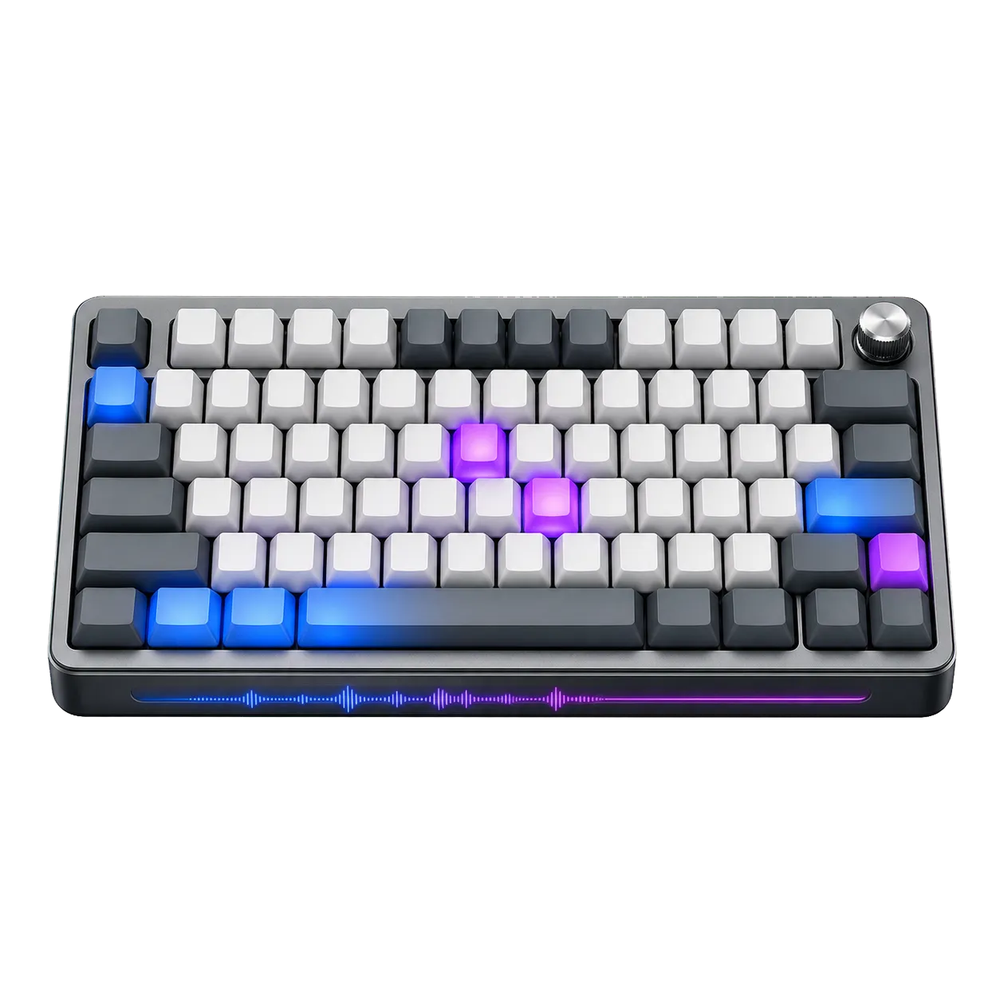

# Keyboard Tester

Test physical keyboard input with visual layouts, key-state highlighting, event details, modifier tracking, and rollover detection.

## Features

- Compact and full visual keyboard layouts for common physical key positions
- Distinct pressed, held, repeated, and released visual states
- Live key value, physical code, key location, and repeat-state details
- Shift, Control, Alt, and Meta modifier reporting
- Current simultaneous-key set and detected rollover count
- Recent keyboard-event history for comparing press and release behaviour
- Accessible focus guidance and a complete reset for clearing the test state

## Screenshot



## How to use

1. Choose the compact or full visual layout.
2. Click or focus the tester so keyboard events are directed to the page.
3. Press individual keys and modifier combinations, then hold keys to test repeat behaviour.
4. Review the visual key states, event details, simultaneous keys, and rollover result.
5. Release all keys and reset the tester before starting a new check.

## Browser support and limitations

The current stable releases of Chromium, Firefox, and Safari are supported.

- Operating-system and browser shortcuts may be intercepted before the page receives them.
- Virtual mobile keyboards do not always expose the same key and code details as physical keyboards.

## Clone and run locally

Requirements:

- Git
- Node.js 22.13.x or Node.js 24.x (recommended)
- Corepack

```bash
git clone https://github.com/mjibulu/keyboard-tester.git
cd keyboard-tester
corepack enable
pnpm install --frozen-lockfile
pnpm run dev
```

The development server prints the local URL to open in your browser.

## Verify

Fast checks:

```bash
pnpm run check
```

Complete browser verification:

```bash
pnpm run verify
```

## Build and host

```bash
pnpm run build
```

Upload the contents of `dist/` to a static host. The application supports both
root and subdirectory hosting and needs no environment variables.

The same output can be deployed with GitHub Pages, Netlify, Cloudflare Pages,
Vercel static hosting, or an ordinary file upload.

## Data and network behaviour

The application ships without analytics or telemetry. Tool processing occurs
in the browser, and the primary browser tests fail unexpected external
requests. See [PRIVACY.md](./PRIVACY.md) for the storage and browser API
inventory.

## Contributing

Issues and pull requests are welcome. Read
[CONTRIBUTING.md](./CONTRIBUTING.md) before submitting a change.

## Credits

Created by M. Jibulu for [eBURP](https://eburp.com/).

## Licence

Original code is available under the [MIT Licence](./LICENSE). Dependencies and
assets retain their own licences; see
[THIRD_PARTY_NOTICES.md](./THIRD_PARTY_NOTICES.md).
